# pwn.college - Binary Reverse Engineering  - level14_testing1

Disclaimer:
- At the time of writing this reverse engineering challenge write-up, I had already solved both this challenge and the teaching version of the challenge, plus all the later pwn.college reverse engineering challenges, so I knew the inner workings of the emulator very well. As a result, I may have glossed over some areas that might seem obvious now, but were potentially important when gathering information for the first time.
- Parts of the solution, such as the GDB script were not written in one go, but were refined over a number of iterations, and the format of the GDB script output borrows heavily from the ouput produced by the teaching version of the ELF binary.

## [Part 0] Setup Challenge
- If using the Docker container setup referred to in [00-Setup](../../00-Setup/index.html), a copy of the ELF binary can be found at `/challenges/babyrev/level14_testing1` in the Docker container, so copy ELF binary to root directory of Docker container, then set privileges and setuid:
> `sudo cp /challenges/babyrev/level14_testing1 / && sudo chmod 4755 /level14_testing1`  
- The original ELF binary can be found here: [download](https://github.com/pwncollege/challenges/raw/master/babyrev/level14_testing1)
- A copy of the ELF binary has also been included here: [download](./level14_testing1)
- Add a fake flag if necessary:
> $ `echo pwn_college{a_secret_fake_flag} | sudo tee /flag && sudo chown root:root /flag && sudo chmod 400 /flag`  
- Test `/flag` file permissions deny access for current `ctf` user:
> $ `whoami`  
> `ctf`  
> $ `ls -al /flag`  
> `-r-------- 1 root root 37 Aug 11 04:37 /flag`  
> $ `cat /flag`  
> `cat: /flag: Permission denied`  

### Basic Info on Challenge Binary
> `rabin2 -I /level14_testing1`  
```
arch     x86
baddr    0x0
binsz    16527
bintype  elf
bits     64
canary   true
class    ELF64
compiler GCC: (Ubuntu 9.3.0-10ubuntu2) 9.3.0
crypto   false
endian   little
havecode true
intrp    /lib64/ld-linux-x86-64.so.2
laddr    0x0
lang     c
linenum  true
lsyms    true
machine  AMD x86-64 architecture
maxopsz  16
minopsz  1
nx       true
os       linux
pcalign  0
pic      true
relocs   true
relro    full
rpath    NONE
sanitiz  false
static   false
stripped false
subsys   linux
va       true
```
- pic is true, i.e. PIE is enabled
- ELF binary is not stripped

### Running Binary
> $ `/level14_testing1`  
```
[+] Welcome to /level14_testing1!
[+] This challenge is an custom emulator. It emulates a completely custom
[+] architecture that we call "Yan85"! You'll have to understand the
[+] emulator to understand the architecture, and you'll have to understand
[+] the architecture to understand the code being emulated, and you will
[+] have to understand that code to get the flag. Good luck!
[+] Starting interpreter loop! Good luck!
ENTER KEY: AAAAAAAA
INCORRECT!
```
- The program is a custom emulator of an unknown architecture called Yan85
- This write-up uses a combination of static and dynamic analysis to determine what instructions emulator supports, if it emulates registers, memory, syscalls, etc, then eventually gets the flag

## [Part 1] Static Analysis Using [radare2](https://rada.re/n/radare2.html)
- Open ELF binary in radare2:
> $ `r2 -A /level14_testing1`  
- The ELF binary is not too large, so `-A` analysis does not take long
- Note: as PIE is enabled, all memory addresses in radare2 should be interpreted **relatively** (i.e. not absolute references)
- List all functions (focus on the interesting ones, e.g. ignore imports `sym.imp.*`):
> [0x00001180]> `afl`  
```
[...]
0x0000129b   15 194          sym.read_register
0x00001269    1 50           sym.crash
[...]
0x00001a7b   17 257          sym.interpret_instruction
[...]
0x000017f5   13 646          sym.interpret_sys
0x000015e6    1 93           sym.interpret_stm
0x00001461    1 48           sym.write_memory
0x00001491    1 51           sym.interpret_imm
0x0000135d   15 223          sym.write_register
0x00001527    5 191          sym.interpret_stk
[...]
0x00001643    1 85           sym.interpret_ldm
0x0000143c    1 37           sym.read_memory
0x00001bff    3 274          main
[...]
0x00001b7c    2 131          sym.interpreter_loop
[...]
0x00001698   12 260          sym.interpret_cmp
0x0000179c    4 89           sym.interpret_jmp
0x000014c4    1 99           sym.interpret_add
[...]
```

#### View main() Function
- Visual Graph mode of `main` function (navigate using `hjkl` keys, press colon `:` to access command line):
> [0x00001180]> `VV @ main` (similar to `agfv @ main`)  
> Press `p` key once to display additional line info  

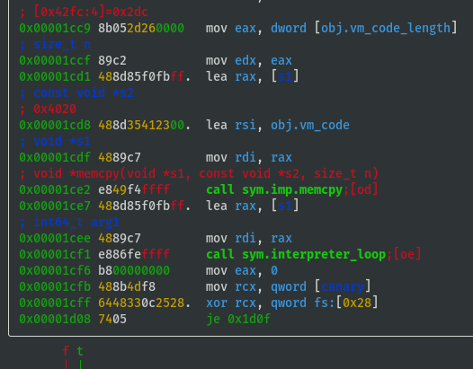

#### Emulator's Bytecode
- `obj.vm_code` should be the emulator's own bytecode and this is being memcpy'd on to the stack
- View hex dump of `obj.vm_code`:
> `V @ obj.vm_code`  
```
[0x00004020 [Xadvc]0 62% 896 /level14_testing1]> xc @ obj.vm_code    
- offset -   0 1  2 3  4 5  6 7  8 9  A B  C D  E F  0123456789ABCDEF  comment
0x00004020  0101 4701 1089 4010 0101 012e 0110 8f40  ..G...@........@  ; obj.vm_code
0x00004030  1001 0101 4c01 1082 4010 0101 01ab 0110  ....L...@.......
0x00004040  8540 1001 0101 8601 1083 4010 0101 0157  .@........@....W
0x00004050  0110 8a40 1001 0101 3401 1086 4010 0101  ...@....4...@...
0x00004060  0127 0110 8740 1001 0101 3b01 108d 4010  .'...@....;...@.
0x00004070  0101 01c2 0110 8c40 1001 0400 2004 0008  .......@.... ...
0x00004080  0400 1001 0801 0208 0201 0145 0400 0101  ...........E....
0x00004090  014e 0400 0101 0154 0400 0101 0145 0400  .N.....T.....E..
0x000040a0  0101 0152 0400 0101 0120 0400 0101 014b  ...R..... .....K
0x000040b0  0400 0101 0145 0400 0101 0159 0400 0101  .....E.....Y....
0x000040c0  013a 0400 0101 0120 0400 0101 100b 0120  .:..... ....... 
0x000040d0  0108 0401 0410 0004 0800 0420 0004 0020  ........... ... 
0x000040e0  0400 0804 0010 0108 4001 100e 0120 0008  ........@.... ..
0x000040f0  0801 0410 0004 0800 0420 0001 0197 0110  ......... ......
0x00004100  8840 1001 0101 a801 108b 4010 0101 0190  .@........@.....
0x00004110  0110 8e40 1001 0101 d201 1084 4010 0101  ...@........@...
0x00004120  0489 0220 1002 0810 0101 ff02 2001 0208  ... ........ ...
0x00004130  0104 0020 0400 0880 2020 8008 0820 2008  ... ....  ...  .  ; str._b_b___b
0x00004140  0408 0004 2000 0101 6a10 0401 0101 ff02  .... ...j.......
0x00004150  1001 0101 0020 1001 0101 5810 0401 0401  ..... ....X.....
0x00004160  1004 0400 0108 0102 0802 0101 4904 0001  ............I...
0x00004170  0101 4e04 0001 0101 4304 0001 0101 4f04  ..N.....C.....O.
0x00004180  0001 0101 5204 0001 0101 5204 0001 0101  ....R.....R.....
0x00004190  4504 0001 0101 4304 0001 0101 5404 0001  E.....C.....T...
0x000041a0  0101 2104 0001 0101 0a04 0001 0110 0b01  ..!.............
0x000041b0  2001 0804 0101 2001 0802 0001 2040 0108   ..... ..... @..
0x000041c0  8401 100c 0101 0202 0104 0400 0101 0456  ...............V
0x000041d0  0110 0020 0110 0101 9610 0201 0101 6c10  ... ..........l.
0x000041e0  1101 0108 0102 0802 0101 4304 0001 0101  ..........C.....
0x000041f0  4f04 0001 0101 5204 0001 0101 5204 0001  O.....R.....R...
0x00004200  0101 4504 0001 0101 4304 0001 0101 5404  ..E.....C.....T.
0x00004210  0001 0101 2104 0001 0101 2004 0001 0101  ....!..... .....
0x00004220  4804 0001 0101 6504 0001 0101 7204 0001  H.....e.....r...
0x00004230  0101 6504 0001 0101 2004 0001 0101 6904  ..e..... .....i.
0x00004240  0001 0101 7304 0001 0101 2004 0001 0101  ....s..... .....
0x00004250  7904 0001 0101 6f04 0001 0101 7504 0001  y.....o.....u...
0x00004260  0101 7204 0001 0101 2004 0001 0101 6604  ..r..... .....f.
0x00004270  0001 0101 6c04 0001 0101 6104 0001 0101  ....l.....a.....
0x00004280  6704 0001 0101 3a04 0001 0101 0a04 0001  g.....:.........
0x00004290  0110 1c01 2001 0804 0101 012f 0110 8040  .... ....../...@
0x000042a0  1001 0101 6601 1081 4010 0101 016c 0110  ....f...@....l..
0x000042b0  8240 1001 0101 6101 1083 4010 0101 0167  .@....a...@....g
0x000042c0  0110 8440 1001 0101 0001 1085 4010 0101  ...@........@...
0x000042d0  2080 0108 0008 2001 0108 8001 10ff 0120   ..... ........
0x000042e0  0002 2001 0808 0101 0880 0110 0002 1001  .. .............
0x000042f0  0120 0108 0401 0120 0008 0200 dc02 0000  . ..... ........  ; obj.vm_code_length
```
- Assuming value @ 0x000042fc is `obj.vm_code_length`, which is `0x02dc` in little endian, test assumption:
> :> `? 0x42fc-0x4020`  
> `uint32  732`  
> `hex     0x2dc`  
- Above vm_code_length assumption seems correct, therefore vm_code is from 0x00004020 to 0x000042fb, inclusive (also recall that PIE is enabled, so these addresses will be different when executing the program, but the relative addresses are still important)
- Some interesting strings are included in the bytecode:
- From 0x00004089 to 0x000040bb "..E.....N.....T.....E.....R..... .....K.....E.....Y.....:"
- From 0x0000416a to 0x000041a2 "..I.....N.....C.....O.....R.....R.....E.....C.....T.....!"
- From 0x000041e8 to 0x00004286 "..C.....O.....R.....R.....E.....C.....T.....!..... .....H.....e.....r.....e..... .....i.....s..... .....y.....o.....u.....r..... .....f.....l.....a.....g.....:"
- Note that the spacing is always the same between the ASCII characters
- Just before the call sym.interpreter_loop, rdi = stack address of the memcpy'd vm_code, rsi = original address of `obj.vm_code`

#### View interpreter_loop() Function
- View `sym.interpreter_loop` function to understand if/how either variables are utilised:
> [0x00001180]> `VV @ sym.interpreter_loop`  
- Looks like rdi (stack address of the memcpy'd vm_code) is used, but rsi isn't:  
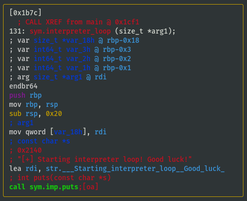
- Last block of code is a loop:  
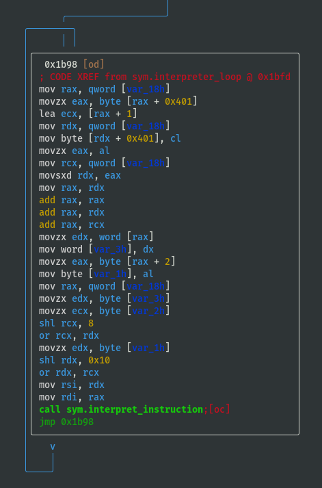
- Above loop iterates over 3 bytes at a time
- Each byte is selected individually by doing some `shl`s (bitwise left shift) and `or`s then they are moved to the stack and back into registers before calling `sym.interpret_instruction`, either to sort or jumble the order (TBD: understand how the order is interpreted)
- Each instruction is therefore **size 3 bytes**

#### View interpret_instruction() Function
- View `sym.interpret_instruction` to understand what instructions are supported by the emulator (focus on the branching, i.e. what `test`/`cmp` conditions are required to either jump or not jump?):
> [0x00001180]> `VV @ sym.interpret_instruction`  
- If opcode==0x01 then call `sym.interpret_imm`:  
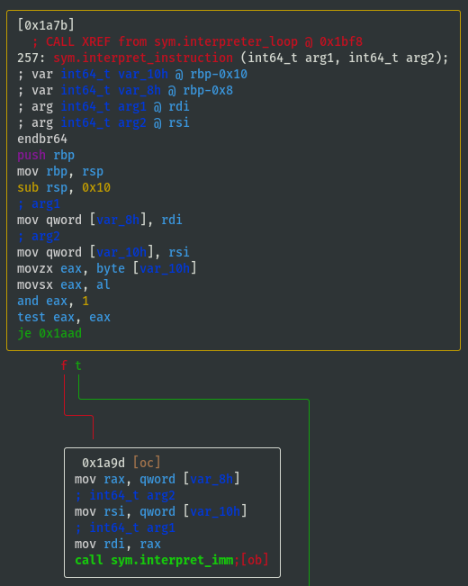
- If opcode==0x02 then call `sym.interpret_add`:  
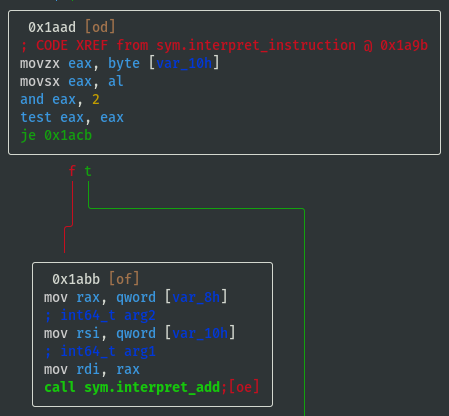
- If opcode==0x04 then call `sym.interpret_stk`:  
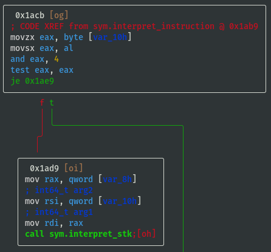
- If opcode==0x40 then call `sym.interpret_stm`:  
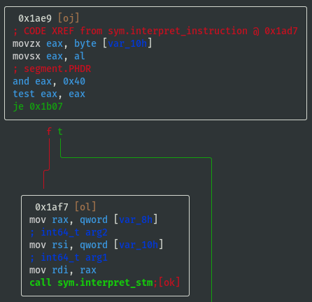
- `test al, al; jns 0x1b1f;` means jump if signed bit (most significant bit) of `al` register is **not** set (i.e. if signed bit **is set** then call `sym.interpret_ldm` because it **didn't jump**), therefore opcode==0x80 is a possible way to call `sym.interpret_ldm`:  
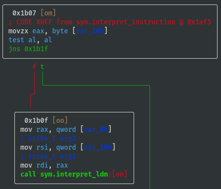
- If opcode==0x20 then call `sym.interpret_cmp`:  
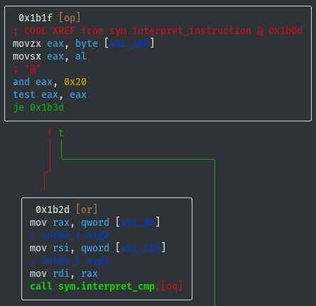
- If opcode==0x10 then call `sym.interpret_jmp`:  
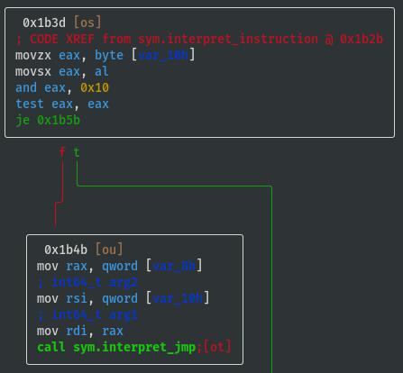
- If opcode==0x08 then call `sym.interpret_sys`:  
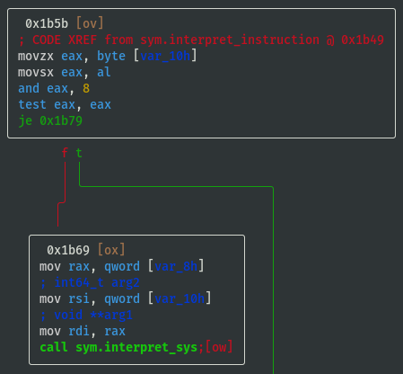

#### View write_register() Function
- Remember the `sys.write_register` from earlier? List functions and perform internal grep for write_register (focus on the branching, i.e. what switch case values are required to reach different registers?):  
> [0x00001180]> `afl~write_register`  
- View `sys.write_register` function to understand the registers:  
> [0x00001180]> `VV @ sym.write_register`  


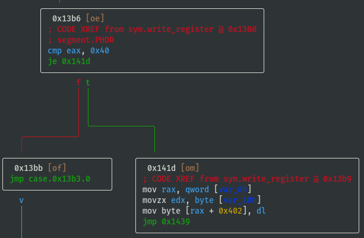
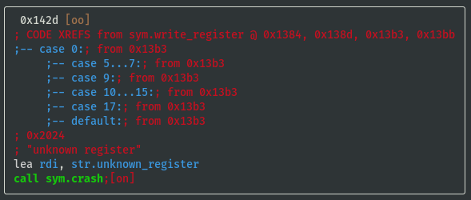
- Register values are stored in memory at offsets 0x3fc to 0x402
- Temporarily name registers by their offsets and note down the switch case lookup refs:
- reg_0x3fc: 0x20 (case 32)
- reg_0x3fd: 0x08 (case 08)
- reg_0x3fe: 0x10 (case 16)
- reg_0x3ff: 0x01 (case 01)
- reg_0x400: 0x02 (case 02)
- reg_0x401: 0x04 (case 04)
- reg_0x402: 0x40 (case 40)

#### View interpret_sys() Function
- View `sym.interpret_sys` to understand what syscalls can be executed by the emulator (focus on the branching, i.e. what `test`/`cmp` conditions are required to either jump or not jump?):
> [0x00001180]> `VV @ sym.interpret_sys`  
- If sys_value==0x20 then call open; int open(const char *path, int oflag):  
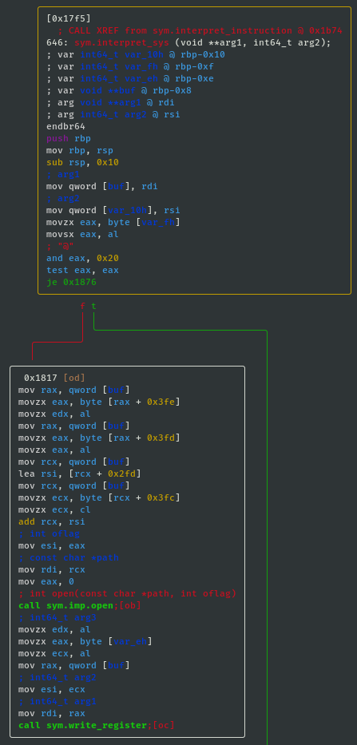
- Below are two code blocks that both make calls to the libc read function. It may not immediately be apparent what the difference between them is, but what is obvious is that they both attempt to read up to count `nbyte` bytes from file descriptor `fildes` into the buffer starting at `buf`. That is actually enough information to solve this challenge, but for later challenges it is worth understanding the difference.
- If sys_value==0x01 then call read; ssize_t read(int fildes, void *buf, size_t nbyte):  
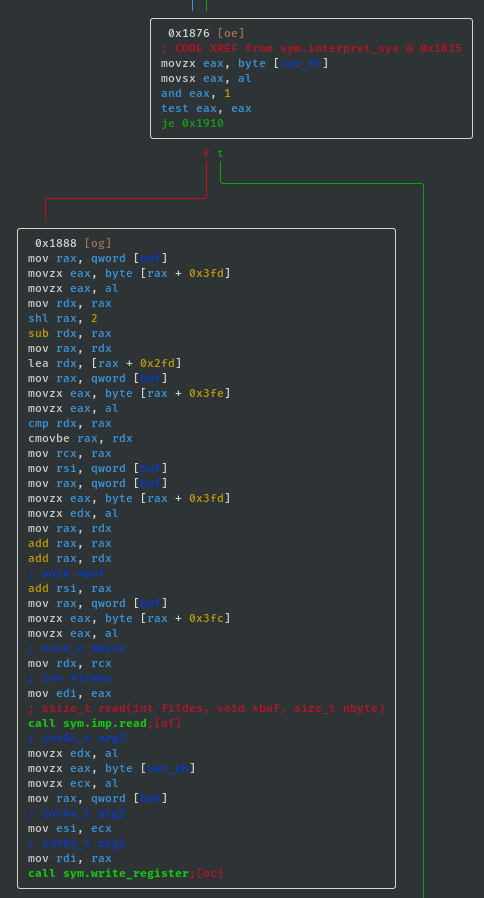
- If sys_value==0x08 then call read; ssize_t read(int fildes, void *buf, size_t nbyte):  
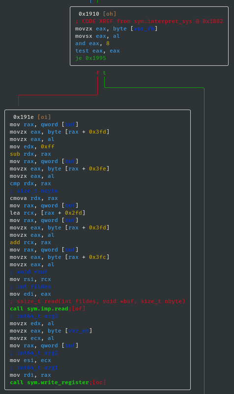
- If sys_value==0x04 then call write; ssize_t write(int fd, const char *ptr, size_t nbytes):  
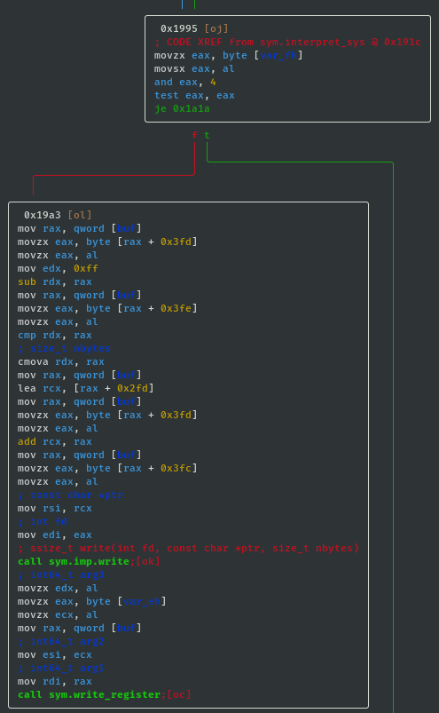
- If sys_value==0x10 then call sleep; int sleep(int s):  
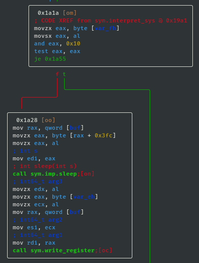
- If sys_value==0x02 then call exit; void exit(int status):  
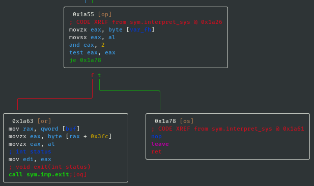

#### View interpret_cmp() Function
- View `sym.interpret_cmp` to understand what values will be set in the emulated flag register (focus on the branching, i.e. what `test`/`cmp` conditions are required to either jump or not jump?), and based on the condition we can assign some identifiable characters ('L', 'G', 'E', 'N', 'Z') for reference:
> [0x00001180]> `VV @ sym.interpret_cmp`  
- If cmp_x < cmp_y (i.e. 'L'), then flag_value = flag_value | 0x10:  
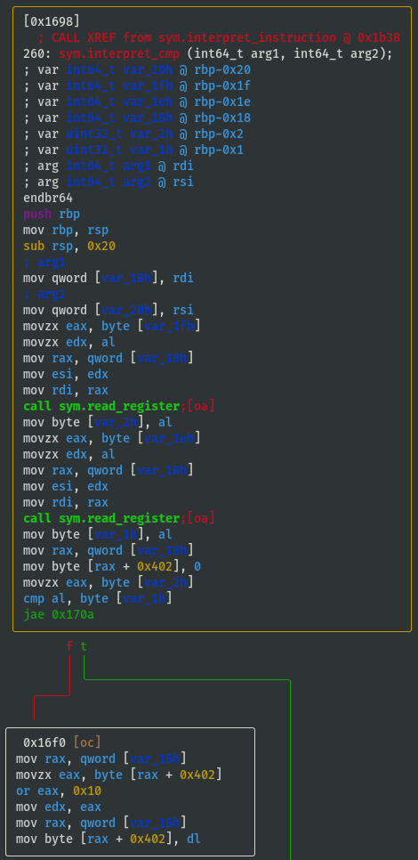
- If cmp_x > cmp_y (i.e. 'G'), then flag_value = flag_value | 0x01:  
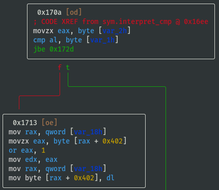
- If cmp_x == cmp_y (i.e. 'E'), then flag_value = flag_value | 0x02:  
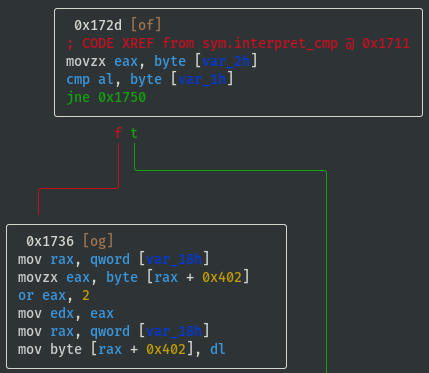
- If cmp_x != cmp_y (i.e. 'N'), then flag_value = flag_value | 0x04:  
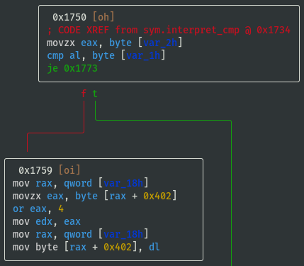
- If cmp_x == cmp_y == 0 (i.e. 'Z'), then flag_value = flag_value | 0x08:  
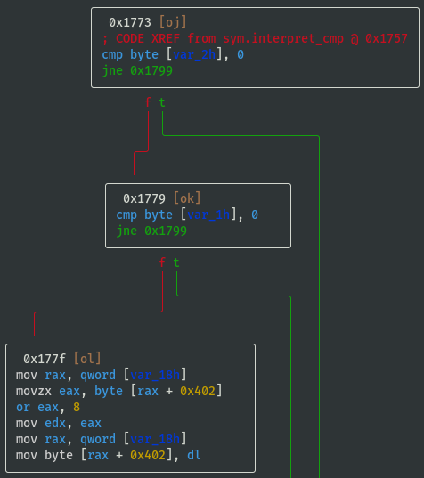

### Summary of Part 1
- Each instruction is **size 3 bytes** (Note: the instruction order can change for different versions of the ELF binary)
- Register, opcode, syscall, compare lookup values are known (Note: the register, opcode, syscall and cmp mappings can change for different versions of the ELF binary):  
```
# Pseudo Python code for notes purposes only
registers = {
    reg_0x3fc: 0x20, # (case 32)
    reg_0x3fd: 0x08, # (case 08)
    reg_0x3fe: 0x10, # (case 16)
    reg_0x3ff: 0x01, # (case 01)
    reg_0x400: 0x02, # (case 02)
    reg_0x401: 0x04, # (case 04)
    reg_0x402: 0x40, # (case 40)
}
opcodes = {
    'imm': 0x01,
    'add': 0x02,
    'stk': 0x04,
    'stm': 0x40,
    'ldm': 0x80,
    'cmp': 0x20,
    'jmp': 0x10,
    'sys': 0x08,
}
syscalls = {
    'open'          : 0x20,
    'read_code'     : 0x01,
    'read_memory'   : 0x08,
    'write'         : 0x04,
    'sleep'         : 0x10,
    'exit'          : 0x02,
}
# CMP and JMP are closely linked, so assume that they interpreted in the same way
jump_description = ''
if flag_value & 0x10: jump_description += 'L'
if flag_value & 0x01: jump_description += 'G'
if flag_value & 0x02: jump_description += 'E'
if flag_value & 0x04: jump_description += 'N'
if flag_value & 0x08: jump_description += 'Z'
```

## [Part 2] Dynamic Analysis Using GDB
> $ `gdb -q /level14_testing1`  
> (gdb) `disass interpret_instruction`  
```
Dump of assembler code for function interpret_instruction:
   [...]
   0x0000000000001aa8 <+45>:	call   0x1491 <interpret_imm>
   [...]
   0x0000000000001ac6 <+75>:	call   0x14c4 <interpret_add>
   [...]
   0x0000000000001ae4 <+105>:	call   0x1527 <interpret_stk>
   [...]
   0x0000000000001b02 <+135>:	call   0x15e6 <interpret_stm>
   [...]
   0x0000000000001b1a <+159>:	call   0x1643 <interpret_ldm>
   [...]
   0x0000000000001b38 <+189>:	call   0x1698 <interpret_cmp>
   [...]
   0x0000000000001b56 <+219>:	call   0x179c <interpret_jmp>
   [...]
   0x0000000000001b74 <+249>:	call   0x17f5 <interpret_sys>
   [...]
```
- Print some helpful output at every breakpoint (`i r`==`info registers`, `x/8i $rip` displays the next 8 instructions):
> (gdb) `define hook-stop`  
```
Type commands for definition of "hook-stop".
End with a line saying just "end".
>i r
>x/8i $rip
>end
```
- Set breakpoint at all `interpret_*` functions:  
> (gdb) `b interpret_imm`  
> (gdb) `b interpret_add`  
> (gdb) `b interpret_stk`  
> (gdb) `b interpret_stm`  
> (gdb) `b interpret_ldm`  
> (gdb) `b interpret_cmp`  
> (gdb) `b interpret_jmp`  
> (gdb) `b interpret_sys`  
- Run program:
> (gdb) `r`  
- 1st cycle, interrupted at `interpret_imm`, `info registers` shows:
> rsi    0x470101    (which is 0x010147 when accounting for endianness)  
- Continue:
> (gdb) `c`  
- 2nd cycle, interrupted at `interpret_imm`, `info registers` shows:
> rsi   0x891001    (which is 0x011089 when accounting for endianness)  
- These are the first 6 bytes of the `obj.vm_code` (emulator's bytecode) looked at in radare2 earlier, recall the following in radare2:  
> `V @ obj.vm_code`  
```
[0x00004020 [Xadvc]0 62% 896 /level14_testing1]> xc @ obj.vm_code    
- offset -   0 1  2 3  4 5  6 7  8 9  A B  C D  E F  0123456789ABCDEF  comment
0x00004020  0101 4701 1089 4010 0101 012e 0110 8f40  ..G...@........@  ; obj.vm_code
0x00004030  1001 0101 4c01 1082 4010 0101 01ab 0110  ....L...@.......
[...]
```
- Split instructions into groups of 3 bytes, then order appears to be [op, arg1, arg2]:
```
[0x01, 0x01, 0x47] -> imm reg_0x3ff, 0x47
[0x01, 0x10, 0x89] -> imm reg_0x3fe, 0x89
[0x40, 0x10, 0x01] -> guess... stm reg_0x3fe, reg_0x3ff maybe?
```
- Test `interpret_stm` assumption by continuing and looking at which interpret_??? function we end up breaking at:  
> (gdb) `c`  
- 3rd cycle, interrupted at `interpret_stm`, `info registers` appears to corroborate above assumption:  
> rsi    0x11040    (which is 0x401001 when accounting for endianness)  
- Keep going through the vm_code to guess the next three instructions:  
```
[0x01, 0x01, 0x2e] -> imm reg_0x3ff, 0x2e
[0x01, 0x10, 0x8f] -> imm reg_0x3fe, 0x8f
[0x40, 0x10, 0x01] -> guess... stm reg_0x3fe, reg_0x3ff again maybe?
```
- Continue again to test assumption:  
> (gdb) `c`  
- 4th cycle, interrupted at `interpret_imm`, `info registers` shows:
> rsi    0x2e0101    (which is 0x01012e when accounting for endianness)  
- Continue:
> (gdb) `c`  
- 5th cycle, interrupted at `interpret_imm`, `info registers` shows:
> rsi    0x8f1001    (which is 0x01108f when accounting for endianness)  
- 6th cycle, interrupted at `interpret_stm`, `info registers` shows:  
> rsi    0x11040    (which is 0x401001 when accounting for endianness)  
- Therefore, instruction order when viewing `obj.vm_code` is [op, arg1, arg2] (Note: the instruction order can change for different versions of the ELF binary)
- At this point (at beginning of 6th cycle, i.e. not yet executed current [0x40, 0x10, 0x01] instruction), based on the instructions executed thus far, the state of the emulator's registers is expected to be:
```
reg_0x3fc = 0x00
reg_0x3fd = 0x00
reg_0x3fe = 0x8f
reg_0x3ff = 0x2e
reg_0x400 = 0x00
reg_0x401 = 0x00
reg_0x402 = 0x00
```
- Assuming there is a register for the instruction pointer, one of the above register values is likely **incorrect**  
- If instruction pointer register holds the value of the **next** instruction, then the value maybe could be 0x06?  
- If instruction pointer register holds the value of the **previous** instruction, then the value maybe could be 0x05?  
- Examine the stack to have a look for the emulator's stored state on the stack (Note: examine much more than the current function's stack frame, because we need to look for the state of the emulator's registers, which will be stored much earlier in the program's stack):  
> (gdb) x/150gx $rsp  
```
[...]
0x7ffe124a57f8:	0x0000000000000000	0x0000000000000000
0x7ffe124a5808:	0x2e8f000000000000	0x00007ffe12000600 <-- These values look familiar
0x7ffe124a5818:	0xa957b0f74c9c8000	0x0000000000000000
0x7ffe124a5828:	0x00007fc32cc8e0b3	0x0000000000000031
0x7ffe124a5838:	0x00007ffe124a5918	0x000000012ce4f618
0x7ffe124a5848:	0x000056465be1dbff	0x000056465be1dd20
```
- Note that the memory addresses are likely to be different each time the program is run, so the relative addresses are the important parts to focus on
- Examine 7 bytes where it looks like the state of the registers is stored:
> (gdb) `x/7bx 0x7ffe124a5808 + 0x04`  
```
0x7ffe124a580c:	0x00	0x00	0x8f	0x2e	0x00	0x06	0x00
??registers???: 0x3fc   0x3fd   0x3fe   0x3ff   0x400   0x401   0x402
```
- Revise assumption on state of the emulator's registers based on dumped stack values:
```
reg_0x3fc = 0x00
reg_0x3fd = 0x00
reg_0x3fe = 0x8f
reg_0x3ff = 0x2e
reg_0x400 = 0x00
reg_0x401 = 0x06 <-- Updated value (likely to be value of instruction pointer)
reg_0x402 = 0x00
```
- Calculate distance emulator's register state is stored on stack **relative** to stack pointer at current breakpoint:
> (gdb) `p $rsp`  
> $1 = (void *) 0x7ffe124a53a8  
> (gdb) `p 0x7ffe124a580c - 0x7ffe124a53a8`  
> $2 = 1124  
- Check calculation is correct:
> (gdb) `p/x $rsp + 1124`
> $3 = 0x7ffe124a580c
- The 1124 (decimal) relative offset from stack pointer should be the same for each of the interpret_* breakpoints, if assumption is wrong it will become apparent in the next section when a GDB script is used to run program in batch mode and print useful info

### Dynamic Analysis Using GDB Scripting
- Write a GDB script using the known mappings derived thus far, snippets of the GDB script will be described below:
> $ `vim /tmp/rev_level14_testing1.gdb`  
- Begin script with `start` so that breakpoint is set at main and process is run:
```
start
```
- Set some variables that will used repeatedly
- `reg_offs` is the offset from rsp that was determined in the previous section that locates the emulator's register state
- In the previous section, the instructions were found to be in rsi at the relevant breakpoints, so `shift_op`, `shift_a1`, `shift_a2` are the amounts to shift rsi by to isolate each byte of the instruction
```
set $reg_offs = 1124
set $shift_op = 0x00
set $shift_a1 = 0x08
set $shift_a2 = 0x10
```
- Register mappings were determined in the radare2 static analysis performed previously:
```
define describe_reg
    if $arg0 == 0x20
        printf "reg_0x3fc"
    end
    if $arg0 == 0x08
        printf "reg_0x3fd"
    end
    if $arg0 == 0x10
        printf "reg_0x3fe"
    end
    if $arg0 == 0x01
        printf "reg_0x3ff"
    end
    if $arg0 == 0x02
        printf "reg_0x400"
    end
    if $arg0 == 0x04
        printf "reg_0x401"
    end
    if $arg0 == 0x40
        printf "reg_0x402"
    end
    if $arg0 == 0x00
        printf "NONE"
    end
end
```
- Syscall mappings were determined in the radare2 static analysis performed previously:
```
define describe_sys
    if $arg0 == 0x20
        printf "open"
    end
    if $arg0 == 0x01
        printf "read_code"
    end
    if $arg0 == 0x08
        printf "read_memory"
    end
    if $arg0 == 0x04
        printf "write"
    end
    if $arg0 == 0x10
        printf "sleep"
    end
    if $arg0 == 0x02
        printf "exit"
    end
end
```
- Jump mappings were determined in the radare2 static analysis performed previously:
```
define describe_jmp
    if $arg0 & 0x10
        printf "L"
    end
    if $arg0 & 0x01
        printf "G"
    end
    if $arg0 & 0x04
        printf "N"
    end
    if $arg0 & 0x08
        printf "Z"
    end
    if $arg0 & 0x02
        printf "E"
    end
end
```
- Define a function that prints the emulator's register state that can be called at each breakpoint:
```
define vm_state
    set $reg_state = (long long) *(void**) ($rsp + $reg_offs)
    printf "[V] reg_0x3fc:%#x reg_0x3fd:%#x reg_0x3fe:%#x reg_0x3ff:%#x reg_0x400:%#x reg_0x401:%#x reg_0x402:%#x\n", $reg_state >> 0x00 & 0xff, $reg_state >> 0x08 & 0xff, $reg_state >> 0x10 & 0xff, $reg_state >> 0x18 & 0xff, $reg_state >> 0x20 & 0xff, $reg_state >> 0x28 & 0xff, $reg_state >> 0x30 & 0xff
end
```
- Define a function that describes each instruction that can be called at each breakpoint:
```
define vm_instruction
    printf "[I] op:%#x arg1:%#x arg2:%#x\n", $rsi>>$shift_op&0xff, $rsi>>$shift_a1&0xff, $rsi>>$shift_a2&0xff
end
```
- Break at all the `interpret_*` function calls and print some useful info using a combo of previously defined helper functions and `printf` specific to each breakpoint:
```
break interpret_imm
commands
    vm_state
    vm_instruction
    printf "[s] IMM "
    describe_reg ($rsi>>$shift_a1&0xff)
    printf " = %#x\n", $rsi>>$shift_a2&0xff
    continue
end

break interpret_add
commands
    vm_state
    vm_instruction
    printf "[s] ADD "
    describe_reg ($rsi>>$shift_a1&0xff)
    printf " "
    describe_reg ($rsi>>$shift_a2&0xff)
    printf " \n"
    continue
end

break interpret_stk
commands
    vm_state
    vm_instruction
    printf "[s] STK "
    describe_reg ($rsi>>$shift_a1&0xff)
    printf " "
    describe_reg ($rsi>>$shift_a2&0xff)
    printf " \n"
    printf "[s] ... pushing "
    describe_reg ($rsi>>$shift_a2&0xff)
    printf "\n"
    printf "[s] ... popping "
    describe_reg ($rsi>>$shift_a1&0xff)
    printf "\n"
    continue
end

break interpret_stm
commands
    vm_state
    vm_instruction
    printf "[s] STM *"
    describe_reg ($rsi>>$shift_a1&0xff)
    printf " = "
    describe_reg ($rsi>>$shift_a2&0xff)
    printf " \n"
    continue
end

break interpret_ldm
commands
    vm_state
    vm_instruction
    printf "[s] LDM "
    describe_reg ($rsi>>$shift_a1&0xff)
    printf " = *"
    describe_reg ($rsi>>$shift_a2&0xff)
    printf " \n"
    continue
end

break interpret_cmp
commands
    vm_state
    vm_instruction
    printf "[s] CMP "
    describe_reg ($rsi>>$shift_a1&0xff)
    printf " "
    describe_reg ($rsi>>$shift_a2&0xff)
    printf " \n"
    continue
end

break interpret_jmp
commands
    vm_state
    vm_instruction
    printf "[s] JMP "
    describe_jmp ($rsi>>$shift_a1&0xff)
    printf " "
    describe_reg ($rsi>>$shift_a2&0xff)
    printf " \n"
    continue
end

break interpret_sys
commands
    vm_state
    vm_instruction
    printf "[s] SYS %#x ", $rsi>>$shift_a1&0xff
    describe_reg ($rsi>>$shift_a2&0xff)
    printf " \n"
    printf "[s] ... "
    describe_sys ($rsi>>$shift_a1&0xff)
    printf " \n"
    continue
end

break crash
commands
    vm_instruction
    printf "[s] CRASH\n"
    continue
end

```
- Finally, end with `continue` so that GDB will be able to continue execution of program:
```
continue
```
- Run GDB in batch mode with the script just written:
> $ `gdb /level14_testing1 -batch -x /tmp/rev_level14_testing1.gdb`  
```
Breakpoint 9, 0x000056246321f7f5 in interpret_sys ()
[V] reg_0x3fc:0 reg_0x3fd:0x40 reg_0x3fe:0xe reg_0x3ff:0xb reg_0x400:0xe reg_0x401:0x46 reg_0x402:0
[I] op:0x8 arg1:0x8 arg2:0x1
[s] SYS 0x8 reg_0x3ff 
[s] ... read_memory 
```
- It stops and waits for input from STDIN, input `AAAAAAAA` to see what happens:
```
[...]
Breakpoint 9, 0x000056246321f7f5 in interpret_sys ()
[V] reg_0x3fc:0x1 reg_0x3fd:0xc reg_0x3fe:0xb reg_0x3ff:0xa reg_0x400:0x16 reg_0x401:0x87 reg_0x402:0x5
[I] op:0x8 arg1:0x4 arg2:0x1
[s] SYS 0x4 reg_0x3ff 
[s] ... write 
INCORRECT!

Breakpoint 2, 0x000056246321f491 in interpret_imm ()
[V] reg_0x3fc:0x1 reg_0x3fd:0xc reg_0x3fe:0xb reg_0x3ff:0xb reg_0x400:0x16 reg_0x401:0x88 reg_0x402:0x5
[I] op:0x1 arg1:0x20 arg2:0x1
[s] IMM reg_0x3fc = 0x1

Breakpoint 9, 0x000056246321f7f5 in interpret_sys ()
[V] reg_0x3fc:0x1 reg_0x3fd:0xc reg_0x3fe:0xb reg_0x3ff:0xb reg_0x400:0x16 reg_0x401:0x89 reg_0x402:0x5
[I] op:0x8 arg1:0x2 arg2:0
[s] SYS 0x2 NONE 
[s] ... exit 
```
- `AAAAAAAA` was incorrect
- Different input can be altered and piped in using a simple inline Python command:
> $ `python -c "import sys; sys.stdout.buffer.write(b'\x41'*20)" | gdb /level14_testing1 -batch -x /tmp/rev_level14_testing1.gdb`  
```
[...]
Breakpoint 9, 0x000056246321f7f5 in interpret_sys ()
[V] reg_0x3fc:0x1 reg_0x3fd:0xc reg_0x3fe:0xb reg_0x3ff:0xa reg_0x400:0x16 reg_0x401:0x87 reg_0x402:0x5
[I] op:0x8 arg1:0x4 arg2:0x1
[s] SYS 0x4 reg_0x3ff 
[s] ... write 
INCORRECT!

Breakpoint 2, 0x000056246321f491 in interpret_imm ()
[V] reg_0x3fc:0x1 reg_0x3fd:0xc reg_0x3fe:0xb reg_0x3ff:0xb reg_0x400:0x16 reg_0x401:0x88 reg_0x402:0x5
[I] op:0x1 arg1:0x20 arg2:0x1
[s] IMM reg_0x3fc = 0x1

Breakpoint 9, 0x000056246321f7f5 in interpret_sys ()
[V] reg_0x3fc:0x1 reg_0x3fd:0xc reg_0x3fe:0xb reg_0x3ff:0xb reg_0x400:0x16 reg_0x401:0x89 reg_0x402:0x5
[I] op:0x8 arg1:0x2 arg2:0
[s] SYS 0x2 NONE 
[s] ... exit 
```
- But the above input was still incorrect

#### Identifying the Instruction Pointer Register
- Analyse the output in more detail by `grep`ping for the somewhere near the start and selecting the 50 lines after it:
> $ `python -c "import sys; sys.stdout.buffer.write(b'\x41'*20)" | gdb /level14_testing1 -batch -x /tmp/rev_level14_testing1.gdb | grep -A50 "\[+\] Starting interpreter loop! Good luck!"`  
```
[+] Starting interpreter loop! Good luck!

Breakpoint 2, 0x000055f95929e491 in interpret_imm ()
[V] reg_0x3fc:0 reg_0x3fd:0 reg_0x3fe:0 reg_0x3ff:0 reg_0x400:0 reg_0x401:0x1 reg_0x402:0
[I] op:0x1 arg1:0x1 arg2:0x47
[s] IMM reg_0x3ff = 0x47

Breakpoint 2, 0x000055f95929e491 in interpret_imm ()
[V] reg_0x3fc:0 reg_0x3fd:0 reg_0x3fe:0 reg_0x3ff:0x47 reg_0x400:0 reg_0x401:0x2 reg_0x402:0
[I] op:0x1 arg1:0x10 arg2:0x89
[s] IMM reg_0x3fe = 0x89

Breakpoint 5, 0x000055f95929e5e6 in interpret_stm ()
[V] reg_0x3fc:0 reg_0x3fd:0 reg_0x3fe:0x89 reg_0x3ff:0x47 reg_0x400:0 reg_0x401:0x3 reg_0x402:0
[I] op:0x40 arg1:0x10 arg2:0x1
[s] STM *reg_0x3fe = reg_0x3ff 

Breakpoint 2, 0x000055f95929e491 in interpret_imm ()
[V] reg_0x3fc:0 reg_0x3fd:0 reg_0x3fe:0x89 reg_0x3ff:0x47 reg_0x400:0 reg_0x401:0x4 reg_0x402:0
[I] op:0x1 arg1:0x1 arg2:0x2e
[s] IMM reg_0x3ff = 0x2e

Breakpoint 2, 0x000055f95929e491 in interpret_imm ()
[V] reg_0x3fc:0 reg_0x3fd:0 reg_0x3fe:0x89 reg_0x3ff:0x2e reg_0x400:0 reg_0x401:0x5 reg_0x402:0
[I] op:0x1 arg1:0x10 arg2:0x8f
[s] IMM reg_0x3fe = 0x8f

Breakpoint 5, 0x000055f95929e5e6 in interpret_stm ()
[V] reg_0x3fc:0 reg_0x3fd:0 reg_0x3fe:0x8f reg_0x3ff:0x2e reg_0x400:0 reg_0x401:0x6 reg_0x402:0
[I] op:0x40 arg1:0x10 arg2:0x1
[s] STM *reg_0x3fe = reg_0x3ff 

Breakpoint 2, 0x000055f95929e491 in interpret_imm ()
[V] reg_0x3fc:0 reg_0x3fd:0 reg_0x3fe:0x8f reg_0x3ff:0x2e reg_0x400:0 reg_0x401:0x7 reg_0x402:0
[I] op:0x1 arg1:0x1 arg2:0x4c
[s] IMM reg_0x3ff = 0x4c

Breakpoint 2, 0x000055f95929e491 in interpret_imm ()
[V] reg_0x3fc:0 reg_0x3fd:0 reg_0x3fe:0x8f reg_0x3ff:0x4c reg_0x400:0 reg_0x401:0x8 reg_0x402:0
[I] op:0x1 arg1:0x10 arg2:0x82
[s] IMM reg_0x3fe = 0x82

Breakpoint 5, 0x000055f95929e5e6 in interpret_stm ()
[V] reg_0x3fc:0 reg_0x3fd:0 reg_0x3fe:0x82 reg_0x3ff:0x4c reg_0x400:0 reg_0x401:0x9 reg_0x402:0
[I] op:0x40 arg1:0x10 arg2:0x1
[s] STM *reg_0x3fe = reg_0x3ff 

Breakpoint 2, 0x000055f95929e491 in interpret_imm ()
[V] reg_0x3fc:0 reg_0x3fd:0 reg_0x3fe:0x82 reg_0x3ff:0x4c reg_0x400:0 reg_0x401:0xa reg_0x402:0
[I] op:0x1 arg1:0x1 arg2:0xab
[s] IMM reg_0x3ff = 0xab
```
- `reg_0x401` is incrementing by 1 at each new instruction, so this again confirms the assumption that this register is keeping track of the instruction pointer

#### Identifying the Stack Pointer Register
- Now grep for some specific instructions (starting with `STK`) and print some lines above and below:
> $ `python -c "import sys; sys.stdout.buffer.write(b'\x41'*20)" | gdb /level14_testing1 -batch -x /tmp/rev_level14_testing1.gdb | grep -B3 -A5 "STK" | grep -v "... popping NONE" | grep -v "... pushing NONE"`  
- Using `-v` tag, exclude lines that print "... popping NONE" and "... pushing NONE", as these are a result of the GDB script not being refined enough to work out when an in instruction is a push only or a pop only instruction
```
Breakpoint 4, 0x0000562462367527 in interpret_stk ()
[V] reg_0x3fc:0 reg_0x3fd:0 reg_0x3fe:0x8c reg_0x3ff:0xc2 reg_0x400:0 reg_0x401:0x1f reg_0x402:0
[I] op:0x4 arg1:0 arg2:0x20
[s] STK NONE reg_0x3fc 
[s] ... pushing reg_0x3fc

Breakpoint 4, 0x0000562462367527 in interpret_stk ()
[V] reg_0x3fc:0 reg_0x3fd:0 reg_0x3fe:0x8c reg_0x3ff:0xc2 reg_0x400:0x1 reg_0x401:0x20 reg_0x402:0
[I] op:0x4 arg1:0 arg2:0x8
[s] STK NONE reg_0x3fd 
[s] ... pushing reg_0x3fd

Breakpoint 4, 0x0000562462367527 in interpret_stk ()
[V] reg_0x3fc:0 reg_0x3fd:0 reg_0x3fe:0x8c reg_0x3ff:0xc2 reg_0x400:0x2 reg_0x401:0x21 reg_0x402:0
[I] op:0x4 arg1:0 arg2:0x10
[s] STK NONE reg_0x3fe 
[s] ... pushing reg_0x3fe

Breakpoint 2, 0x0000562462367491 in interpret_imm ()
[V] reg_0x3fc:0 reg_0x3fd:0 reg_0x3fe:0x8c reg_0x3ff:0xc2 reg_0x400:0x3 reg_0x401:0x22 reg_0x402:0
--
Breakpoint 4, 0x0000562462367527 in interpret_stk ()
[V] reg_0x3fc:0 reg_0x3fd:0x4 reg_0x3fe:0x8c reg_0x3ff:0x45 reg_0x400:0x3 reg_0x401:0x25 reg_0x402:0
[I] op:0x4 arg1:0 arg2:0x1
[s] STK NONE reg_0x3ff 
[s] ... pushing reg_0x3ff

Breakpoint 2, 0x0000562462367491 in interpret_imm ()
[V] reg_0x3fc:0 reg_0x3fd:0x4 reg_0x3fe:0x8c reg_0x3ff:0x45 reg_0x400:0x4 reg_0x401:0x26 reg_0x402:0
[...]
```
- From the above output, it can be seen that the line showing the register state **after** each **push** instruction, the value of `reg_0x400` **increases**
- If we keep looking through the output, there are some pop instructions:
```
[...]
Breakpoint 4, 0x0000562462367527 in interpret_stk ()
[V] reg_0x3fc:0 reg_0x3fd:0x40 reg_0x3fe:0xe reg_0x3ff:0xe reg_0x400:0xe reg_0x401:0x47 reg_0x402:0
[I] op:0x4 arg1:0x10 arg2:0
[s] STK reg_0x3fe NONE 
[s] ... popping reg_0x3fe

Breakpoint 4, 0x0000562462367527 in interpret_stk ()
[V] reg_0x3fc:0 reg_0x3fd:0x40 reg_0x3fe:0x20 reg_0x3ff:0xe reg_0x400:0xd reg_0x401:0x48 reg_0x402:0
[I] op:0x4 arg1:0x8 arg2:0
[s] STK reg_0x3fd NONE 
[s] ... popping reg_0x3fd

Breakpoint 4, 0x0000562462367527 in interpret_stk ()
[V] reg_0x3fc:0 reg_0x3fd:0x3a reg_0x3fe:0x20 reg_0x3ff:0xe reg_0x400:0xc reg_0x401:0x49 reg_0x402:0
[I] op:0x4 arg1:0x20 arg2:0
[s] STK reg_0x3fc NONE 
[s] ... popping reg_0x3fc

Breakpoint 2, 0x0000562462367491 in interpret_imm ()
[V] reg_0x3fc:0x59 reg_0x3fd:0x3a reg_0x3fe:0x20 reg_0x3ff:0xe reg_0x400:0xb reg_0x401:0x4a reg_0x402:0
[...]
```
- From the above output, it can be seen that the line showing the register state **after** each **pop** instruction, the value of `reg_0x400` **decreases**
- Therefore `reg_0x400` should be the **stack pointer**
- Some instructions are a push and a pop in the **same** instruction, e.g.:
```
[...]
Breakpoint 4, 0x0000556ee88bd527 in interpret_stk ()
[V] reg_0x3fc:0x4b reg_0x3fd:0x8f reg_0x3fe:0xc reg_0x3ff:0x6a reg_0x400:0xc reg_0x401:0x6b reg_0x402:0x5
[I] op:0x4 arg1:0x1 arg2:0x10
[s] STK reg_0x3ff reg_0x3fe 
[s] ... pushing reg_0x3fe
[s] ... popping reg_0x3ff

Breakpoint 4, 0x0000556ee88bd527 in interpret_stk ()
[V] reg_0x3fc:0x4b reg_0x3fd:0x8f reg_0x3fe:0xc reg_0x3ff:0xc reg_0x400:0xc reg_0x401:0x6c reg_0x402:0x5
[...]
```
- The line showing the register state **after** each **push-pop** instruction, the value of `reg_0x400` stays the **same**
- The above output shows that the value in `reg_0x3fe` is first pushed on to the stack and immediately popped into `reg_0x3ff`

#### Identifying the Flag Register
- Now send forty b'\x41' bytes, grep for `CMP` instruction and print some lines above and below:
> $ `python -c "import sys; sys.stdout.buffer.write(b'\x41'*40)" | gdb /level14_testing1 -batch -x /tmp/rev_level14_testing1.gdb | grep -B3 -A3 "CMP"`  
```
Breakpoint 7, 0x00005628cc387698 in interpret_cmp ()
[V] reg_0x3fc:0x41 reg_0x3fd:0x2e reg_0x3fe:0xc reg_0x3ff:0xff reg_0x400:0xe reg_0x401:0x60 reg_0x402:0
[I] op:0x20 arg1:0x20 arg2:0x8
[s] CMP reg_0x3fc reg_0x3fd 

Breakpoint 4, 0x00005628cc387527 in interpret_stk ()
[V] reg_0x3fc:0x41 reg_0x3fd:0x2e reg_0x3fe:0xc reg_0x3ff:0xff reg_0x400:0xe reg_0x401:0x61 reg_0x402:0x5
[...]
```
- So the first time the breakpoint hits the `interpret_cmp` instruction it's comparing `reg_0x3fc:0x41` vs `reg_0x3fd:0x2e`
- `reg_0x3fc` value is 0x41, which looks like it could be one of our inputted values
- From the previous static analysis using radare2, the `interpret_cmp` instruction set flags in the following manner:
```
# Pseudo Python code for notes purposes only
flag_value = ''
if cmp_x < cmp_y: flag_value += flag_value | 0x10 # i.e. 'L'
if cmp_x > cmp_y: flag_value += flag_value | 0x01 # i.e. 'G'
if cmp_x == cmp_y: flag_value += flag_value | 0x02 # i.e. 'E'
if cmp_x != cmp_y: flag_value += flag_value | 0x04 # i.e. 'N'
if cmp_x == cmp_y == 0: flag_value += flag_value | 0x08 # i.e. 'Z'
```
- 0x41 > 0x2e and they are not equal, so we expect flag_value to be `or`'d with both 0x01 and 0x04, which equates to 0x05
- The line showing the register state **after** the **cmp** instruction, the value of `reg_0x402` changes to 0x05
- Try again with different input (this time, forty null bytes):
> $ `python -c "import sys; sys.stdout.buffer.write(b'\x00'*40)" | gdb /level14_testing1 -batch -x /tmp/rev_level14_testing1.gdb | grep -B3 -A3 "CMP"`  
```
Breakpoint 7, 0x000056067b2c8698 in interpret_cmp ()
[V] reg_0x3fc:0 reg_0x3fd:0x2e reg_0x3fe:0xc reg_0x3ff:0xff reg_0x400:0xe reg_0x401:0x60 reg_0x402:0
[I] op:0x20 arg1:0x20 arg2:0x8
[s] CMP reg_0x3fc reg_0x3fd 

Breakpoint 4, 0x000056067b2c8527 in interpret_stk ()
[V] reg_0x3fc:0 reg_0x3fd:0x2e reg_0x3fe:0xc reg_0x3ff:0xff reg_0x400:0xe reg_0x401:0x61 reg_0x402:0x14
[...]
```
- For the null bytes input, the first time it hits the `interpret_cmp` breakpoint, it's comparing `reg_0x3fc:0x00` vs `reg_0x3fd:0x2e`
- Again, `reg_0x3fc` value (0x00) looks like it's one of our inputted values
- 0x00 < 0x2e and they are not equal, so we expect flag_value to be `or`'d with both 0x10 and 0x04, which equates 0x14
- The line showing the register state **after** the **cmp** instruction, the value of `reg_0x402` changes to 0x14, so the assumptions on the `interpret_cmp` instruction appear correct so far
- This time, try a **non-repeating pattern** as input to see which index of our input is used in the comparison:
> $ `python -c "import sys; sys.stdout.buffer.write(b'\xe1\xe2\xe3\xe4\xe5\xe6\xe7\xe8\xe9\xea\xeb\xec\xed\xee\xef\xf0\xf1\xf2\xf3\xf4\xf5\xf6\xf7\xf8\xf9\xfa\xfb\xfc\xfd\xfe\xff')" | gdb /level14_testing1 -batch -x /tmp/rev_level14_testing1.gdb | grep -B3 -A3 "CMP"`  
```
Breakpoint 7, 0x000055b0ca655698 in interpret_cmp ()
[V] reg_0x3fc:0xec reg_0x3fd:0x2e reg_0x3fe:0xc reg_0x3ff:0xff reg_0x400:0xe reg_0x401:0x60 reg_0x402:0
[I] op:0x20 arg1:0x20 arg2:0x8
[s] CMP reg_0x3fc reg_0x3fd 

Breakpoint 4, 0x000055b0ca655527 in interpret_stk ()
[V] reg_0x3fc:0xec reg_0x3fd:0x2e reg_0x3fe:0xc reg_0x3ff:0xff reg_0x400:0xe reg_0x401:0x61 reg_0x402:0x5
[...]
```
- From above output, the comparison is now between `reg_0x3fc:0xec` vs `reg_0x3fd:0x2e`, so let's summarise, update assumptions and refine the GDB script in the step below

### Summary of Part 2
- `reg_0x3fc`, `reg_0x3fd`, `reg_0x3fe`, `reg_0x3ff` seem to be general purpose registers
- `reg_0x400` is the stack pointer register
- `reg_0x401` is the instruction pointer register
- `reg_0x402` is the flag register that uses bitmasks to set relevant flags
- Sending input of `b'\xe1\xe2\xe3\xe4\xe5\xe6\xe7\xe8\xe9\xea\xeb\xec\xed\xee\xef\xf0\xf1\xf2\xf3\xf4\xf5\xf6\xf7\xf8\xf9\xfa\xfb\xfc\xfd\xfe\xff'` led to first comparison being made by emulator between 0xec and 0x2e
- Each instruction is **size 3 bytes** (Note: the instruction order can change for different versions of the ELF binary)
- Register, opcode, syscall, compare lookup values are known (Note: the register, opcode, syscall and cmp mappings can change for different versions of the ELF binary)
- Rename registers based on new info:  
```
# Pseudo Python code for notes purposes only
registers = {
    a: 0x20, # (case 32)
    b: 0x08, # (case 08)
    c: 0x10, # (case 16)
    d: 0x01, # (case 01)
    s: 0x02, # (case 02)
    i: 0x04, # (case 04)
    f: 0x40, # (case 40)
}
opcodes = {
    'imm': 0x01,
    'add': 0x02,
    'stk': 0x04,
    'stm': 0x40,
    'ldm': 0x80,
    'cmp': 0x20,
    'jmp': 0x10,
    'sys': 0x08,
}
syscalls = {
    'open'          : 0x20,
    'read_code'     : 0x01,
    'read_memory'   : 0x08,
    'write'         : 0x04,
    'sleep'         : 0x10,
    'exit'          : 0x02,
}
jump_description = ''
if flag_value & 0x10: jump_description += 'L'
if flag_value & 0x01: jump_description += 'G'
if flag_value & 0x02: jump_description += 'E'
if flag_value & 0x04: jump_description += 'N'
if flag_value & 0x08: jump_description += 'Z'
```
- Update GDB script with new register names:
```
[...]
define describe_reg
    if $arg0 == 0x20
        printf "a"
    end
    if $arg0 == 0x08
        printf "b"
    end
    if $arg0 == 0x10
        printf "c"
    end
    if $arg0 == 0x01
        printf "d"
    end
    if $arg0 == 0x02
        printf "s"
    end
    if $arg0 == 0x04
        printf "i"
    end
    if $arg0 == 0x40
        printf "f"
    end
    if $arg0 == 0x00
        printf "NONE"
    end
end
[...]
define vm_state
    set $reg_state = (long long) *(void**) ($rsp + $reg_offs)
    printf "[V] a:%#x b:%#x c:%#x d:%#x s:%#x i:%#x f:%#x\n", $reg_state >> 0x00 & 0xff, $reg_state >> 0x08 & 0xff, $reg_state >> 0x10 & 0xff, $reg_state >> 0x18 & 0xff, $reg_state >> 0x20 & 0xff, $reg_state >> 0x28 & 0xff, $reg_state >> 0x30 & 0xff
end
[...]
```

## [Part 3] Crafting the Solution
- With revised GDB script, try a **non-repeating pattern** as input, but change the 0xec to 0x2e:
> $ `python -c "import sys; sys.stdout.buffer.write(b'\xe1\xe2\xe3\xe4\xe5\xe6\xe7\xe8\xe9\xea\xeb\x2e\xed\xee\xef\xf0\xf1\xf2\xf3\xf4\xf5\xf6\xf7\xf8\xf9\xfa\xfb\xfc\xfd\xfe\xff')" | gdb /level14_testing1 -batch -x /tmp/rev_level14_testing1.gdb | grep -B3 -A3 "CMP"`  
- This time the output is different, there are more comparisons:
```
Breakpoint 7, 0x0000563eab40e698 in interpret_cmp ()
[V] a:0x2e b:0x2e c:0xc d:0xff s:0xe i:0x60 f:0
[I] op:0x20 arg1:0x20 arg2:0x8
[s] CMP a b 

Breakpoint 4, 0x0000563eab40e527 in interpret_stk ()
[V] a:0x2e b:0x2e c:0xc d:0xff s:0xe i:0x61 f:0x2
--
Breakpoint 7, 0x0000563eab40e698 in interpret_cmp ()
[V] a:0x4b b:0x8f c:0xb d:0 s:0xc i:0x68 f:0x2
[I] op:0x20 arg1:0x10 arg2:0x1
[s] CMP c d 

Breakpoint 2, 0x0000563eab40e491 in interpret_imm ()
[V] a:0x4b b:0x8f c:0xb d:0 s:0xc i:0x69 f:0x5
--
Breakpoint 7, 0x0000563eab40e698 in interpret_cmp ()
[V] a:0xeb b:0x90 c:0xb d:0xff s:0xe i:0x60 f:0x5
[I] op:0x20 arg1:0x20 arg2:0x8
[s] CMP a b 

Breakpoint 4, 0x0000563eab40e527 in interpret_stk ()
[V] a:0xeb b:0x90 c:0xb d:0xff s:0xe i:0x61 f:0x5
[...]
```
- Now try changing the 0xeb to 0x90 and only grep for "CMP a b" as this looks like the important comparison:
> $ `python -c "import sys; sys.stdout.buffer.write(b'\xe1\xe2\xe3\xe4\xe5\xe6\xe7\xe8\xe9\xea\x90\x2e\xed\xee\xef\xf0\xf1\xf2\xf3\xf4\xf5\xf6\xf7\xf8\xf9\xfa\xfb\xfc\xfd\xfe\xff')" | gdb /level14_testing1 -batch -x /tmp/rev_level14_testing1.gdb | grep -B3 -A3 "CMP a b"`  
- Again the output is different as there's also a comparison between 0xea and 0x3b, looks like we're making progress:
```
Breakpoint 7, 0x0000562fa1832698 in interpret_cmp ()
[V] a:0x2e b:0x2e c:0xc d:0xff s:0xe i:0x60 f:0
[I] op:0x20 arg1:0x20 arg2:0x8
[s] CMP a b 

Breakpoint 4, 0x0000562fa1832527 in interpret_stk ()
[V] a:0x2e b:0x2e c:0xc d:0xff s:0xe i:0x61 f:0x2
--
Breakpoint 7, 0x0000562fa1832698 in interpret_cmp ()
[V] a:0x90 b:0x90 c:0xb d:0xff s:0xe i:0x60 f:0x5
[I] op:0x20 arg1:0x20 arg2:0x8
[s] CMP a b 

Breakpoint 4, 0x0000562fa1832527 in interpret_stk ()
[V] a:0x90 b:0x90 c:0xb d:0xff s:0xe i:0x61 f:0x2
--
Breakpoint 7, 0x0000562fa1832698 in interpret_cmp ()
[V] a:0xea b:0x3b c:0xa d:0xff s:0xe i:0x60 f:0x5
[I] op:0x20 arg1:0x20 arg2:0x8
[s] CMP a b 

Breakpoint 4, 0x0000562fa1832527 in interpret_stk ()
[V] a:0xea b:0x3b c:0xa d:0xff s:0xe i:0x61 f:0x5
```
- As it seems like our input from 0xed onward is being discarded, let's continue on this basis and also keep updating the compared value to what it seems like the program wants (also don't bother `grep`ping for the lines after the specifed criteria):
> $ `python -c "import sys; sys.stdout.buffer.write(b'\xe1\xe2\xe3\xe4\xe5\xe6\xe7\xe8\xe9\x3b\x90\x2e')" | gdb /level14_testing1 -batch -x /tmp/rev_level14_testing1.gdb | grep -B3 "CMP a b"`  
```
Breakpoint 7, 0x000055d923803698 in interpret_cmp ()
[V] a:0x2e b:0x2e c:0xc d:0xff s:0xe i:0x60 f:0
[I] op:0x20 arg1:0x20 arg2:0x8
[s] CMP a b 
--
Breakpoint 7, 0x000055d923803698 in interpret_cmp ()
[V] a:0x90 b:0x90 c:0xb d:0xff s:0xe i:0x60 f:0x5
[I] op:0x20 arg1:0x20 arg2:0x8
[s] CMP a b 
--
Breakpoint 7, 0x000055d923803698 in interpret_cmp ()
[V] a:0x3b b:0x3b c:0xa d:0xff s:0xe i:0x60 f:0x5
[I] op:0x20 arg1:0x20 arg2:0x8
[s] CMP a b 
--
Breakpoint 7, 0x000055d923803698 in interpret_cmp ()
[V] a:0xe9 b:0xc2 c:0x9 d:0xff s:0xe i:0x60 f:0x5
[I] op:0x20 arg1:0x20 arg2:0x8
[s] CMP a b 
```
- Keep going, change 0xe9 to 0xc2
> $ `python -c "import sys; sys.stdout.buffer.write(b'\xe1\xe2\xe3\xe4\xe5\xe6\xe7\xe8\xc2\x3b\x90\x2e')" | gdb /level14_testing1 -batch -x /tmp/rev_level14_testing1.gdb | grep -B3 "CMP a b"`  
```
Breakpoint 7, 0x000055c98537f698 in interpret_cmp ()
[V] a:0x2e b:0x2e c:0xc d:0xff s:0xe i:0x60 f:0
[I] op:0x20 arg1:0x20 arg2:0x8
[s] CMP a b 
--
Breakpoint 7, 0x000055c98537f698 in interpret_cmp ()
[V] a:0x90 b:0x90 c:0xb d:0xff s:0xe i:0x60 f:0x5
[I] op:0x20 arg1:0x20 arg2:0x8
[s] CMP a b 
--
Breakpoint 7, 0x000055c98537f698 in interpret_cmp ()
[V] a:0x3b b:0x3b c:0xa d:0xff s:0xe i:0x60 f:0x5
[I] op:0x20 arg1:0x20 arg2:0x8
[s] CMP a b 
--
Breakpoint 7, 0x000055c98537f698 in interpret_cmp ()
[V] a:0xc2 b:0xc2 c:0x9 d:0xff s:0xe i:0x60 f:0x5
[I] op:0x20 arg1:0x20 arg2:0x8
[s] CMP a b 
--
Breakpoint 7, 0x000055c98537f698 in interpret_cmp ()
[V] a:0xe8 b:0xa8 c:0x8 d:0xff s:0xe i:0x60 f:0x5
[I] op:0x20 arg1:0x20 arg2:0x8
[s] CMP a b 
```
- Assuming that the comparisons keep being made until the start of the input, we can either carry on in this manner, or write a script to finish the rest
- Although there aren't many comparisons left to be made, doing this manually doesn't sound interesting, so let's write a Python script to get us the flag

### Get Flag Script Using Python
- `vim /tmp/rev_level14_testing1.py`
```
import os
import re
import subprocess

elf_binary = '/level14_testing1'
gdb_script = '/tmp/rev_level14_testing1.gdb'

def bytes_str(bytes_obj: bytes) -> str:
    # Takes bytes type object as argument and returns string in hex '\x' format
    return ''.join(f'\\x{byte:02x}' for byte in bytes_obj)

def get_key() -> bytes:
    key = b''.join(byte.to_bytes(1, 'big') for byte in range(0xe0, 0x100))
    print('[*] Obtaining key via GDB script:')

    # Loop through key attempt in reverse order as ELF binary does CMP in this order
    for i in range(len(key)-1, -1, -1):
        sp = subprocess.run(
            ['gdb', elf_binary, '-batch', '-x', gdb_script],
            input = key,
            stdout = subprocess.PIPE,
            stderr = subprocess.PIPE,
        )
        out = sp.stdout.decode('latin1')

        # Extract a and b from output
        cmp_ab = re.findall('\[V\] a:0x(.*) b:0x(.*) c:.* d:.* s:.* f:.*\n.*\n\[s\] CMP a b', out)[::-1]
        a = int(cmp_ab[i][0], 16) if len(cmp_ab)==len(key) else int(cmp_ab[0][0], 16)
        b = int(cmp_ab[i][1], 16) if len(cmp_ab)==len(key) else int(cmp_ab[0][1], 16)
        print(f"index={i:02d} a={hex(a)} b={hex(b)} test_key=b'{bytes_str(key)}'")

        # Update key by overwriting immutable bytes object with b at index i if our input a is found
        key = key[:i] + b.to_bytes(1, 'big') + key[i+1:] if key[i]==a else key[:i]

    print(f'Key: {bytes_str(key)}', end='\n\n')
    return key

def get_flag(key: bytes) -> str:
    print('[*] Obtaining flag from setuid binary:')
    sp = subprocess.run(
        [elf_binary],
        input = key,
        stdout = subprocess.PIPE,
        stderr = subprocess.PIPE,
    )
    out = sp.stdout.decode('latin1')
    flag = re.findall('_college{(.*)}', out)
    return f'pwn_college{{{flag[0]}}}' if len(flag) else ''

def main():
    assert os.path.isfile(elf_binary), f'Could not find file {elf_binary}'
    assert os.path.isfile(gdb_script), f'Could not find file {gdb_script}'
    key = get_key()
    flag = get_flag(key)
    print(flag) if flag else print('Error obtaining flag')
    exit(42)

if __name__=='__main__':
    main()
```
- Run the script:
> $ `python /tmp/rev_level14_testing1.py`
```
[...]
Key: \xd2\xab\x34\x27\x97\x47\x57\xa8\xc2\x3b\x90\x2e

[*] Obtaining flag from setuid binary:
pwn_college{a_secret_fake_flag}
```
- And there's the flag
- We can also `echo` the key and pipe it to the ELF binary to confirm:
> $ `echo -ne "\xd2\xab\x34\x27\x97\x47\x57\xa8\xc2\x3b\x90\x2e" | /level14_testing1`  
```
[+] Welcome to /level14_testing1!
[+] This challenge is an custom emulator. It emulates a completely custom
[+] architecture that we call "Yan85"! You'll have to understand the
[+] emulator to understand the architecture, and you'll have to understand
[+] the architecture to understand the code being emulated, and you will
[+] have to understand that code to get the flag. Good luck!
[+] Starting interpreter loop! Good luck!
ENTER KEY: CORRECT! Here is your flag:
pwn_college{a_secret_fake_flag}
```
